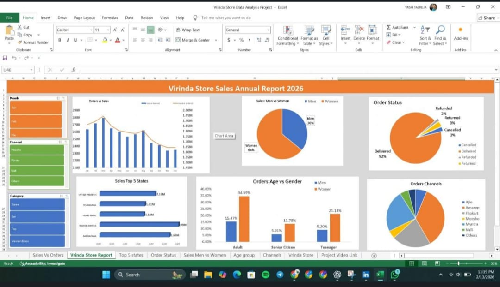

🛍️ Virinda Store Annual Report

  

📊 Project Overview
Designed a comprehensive and visually engaging annual sales dashboard to evaluate the overall performance of Virinda Store. This project focuses on uncovering key business insights by analyzing sales trends, customer behavior, and product performance over an entire year.

🔍 Key Insights & Analysis

📅 Identified monthly and seasonal sales trends to understand peak business periods

🛒 Analyzed top-performing products and categories driving maximum revenue

👥 Explored customer demographics and purchasing patterns

📈 Evaluated year-over-year growth and revenue fluctuations

🌍 Compared regional sales distribution to identify high-performing markets

🛠️ Tools & Technologies

📊 Power BI

📑 Excel

💡 Business Impact

🚀 Enabled better inventory and demand planning

📉 Helped reduce losses by identifying underperforming areas

🎯 Supported strategic decision-making for future growth
